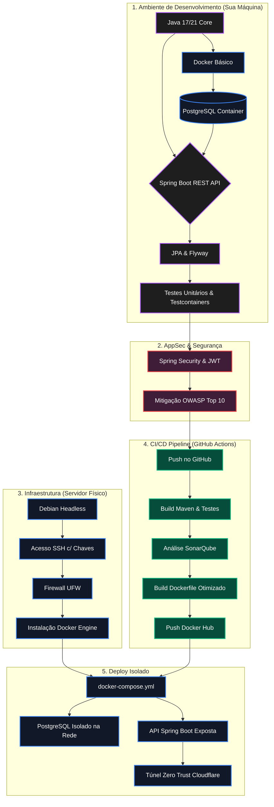

```mermaid
graph TD
    %% Estilos visuais focados em alto contraste
    classDef base fill:#1e1e1e,stroke:#a855f7,stroke-width:2px,color:#fff
    classDef infra fill:#111827,stroke:#3b82f6,stroke-width:2px,color:#fff
    classDef seguranca fill:#3f1d38,stroke:#ef4444,stroke-width:2px,color:#fff
    classDef ci fill:#064e3b,stroke:#10b981,stroke-width:2px,color:#fff

    subgraph Maquina_Local ["1. Ambiente de Desenvolvimento (Sua Máquina)"]
        A[Java 17/21 Core] --> B[Docker Básico]
        B --> C[(PostgreSQL Container)]
        A --> D{Spring Boot REST API}
        C --> D
        D --> E[JPA & Flyway]
        E --> F[Testes Unitários & Testcontainers]
    end

    subgraph Blindagem ["2. AppSec & Segurança"]
        F --> G[Spring Security & JWT]
        G --> H[Mitigação OWASP Top 10]
    end

    subgraph Bare_Metal ["3. Infraestrutura (Servidor Físico)"]
        I[Debian Headless] --> J[Acesso SSH c/ Chaves]
        J --> K[Firewall UFW]
        K --> L[Instalação Docker Engine]
    end

    subgraph Automacao ["4. CI/CD Pipeline (GitHub Actions)"]
        H --> M[Push no GitHub]
        M --> N[Build Maven & Testes]
        N --> O[Análise SonarQube]
        O --> P[Build Dockerfile Otimizado]
        P --> Q[Push Docker Hub]
    end

    subgraph Producao ["5. Deploy Isolado"]
        L --> R[docker-compose.yml]
        Q --> R
        R --> S[PostgreSQL Isolado na Rede]
        R --> T[API Spring Boot Exposta]
        T --> U[Túnel Zero Trust Cloudflare]
    end

    %% Aplicação de estilos
    class A,D,E,F base;
    class B,C,I,J,K,L,R,S,T,U infra;
    class G,H seguranca;
    class M,N,O,P,Q ci;
```
